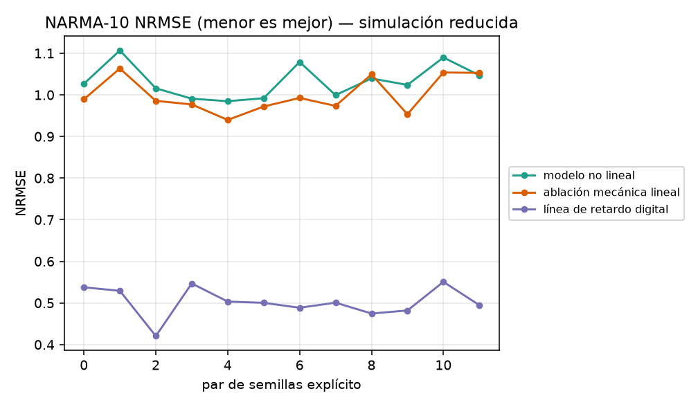

# Graphene Phonon Reservoir

Repositorio de investigación reproducible para estudiar un reservorio físico basado en un modelo reducido de modos mecánicos acoplados inspirados en resonadores de grafeno. El proyecto pone a prueba una pregunta concreta: **¿la dinámica mecánica no lineal mejora el procesamiento temporal frente a controles más simples?**

Bajo el protocolo y el presupuesto computacional evaluados, la respuesta fue negativa. El modelo no lineal no superó una ablación mecánica lineal ni una línea de retardo digital. El repositorio conserva ese resultado con el código, las semillas, los datos, las figuras y el informe necesarios para reproducirlo.



## Qué es y para qué sirve

En *physical reservoir computing*, una señal de entrada excita un sistema dinámico y un readout sencillo aprende a interpretar su respuesta. En el protocolo publicado, ese sistema es una simulación de 16 modos mecánicos efectivos con acoplamiento, electrostática dependiente del hueco, no linealidad y lectura óptica.

El repositorio sirve para:

- reproducir un resultado negativo bien delimitado;
- comparar los términos mecánicos de Duffing y amortiguamiento no lineal con una ablación pareada que conserva semillas, electrostática, lectura óptica y los demás parámetros;
- estudiar una cadena completa de simulación, lectura, entrenamiento y evaluación con separación cronológica entre entrenamiento y prueba;
- usar el protocolo como ejemplo docente de falsificación temprana y reporte honesto en computación física.

No es un diseño de dispositivo ni una herramienta de fabricación. Los parámetros representan un punto de simulación ilustrativo y no una geometría caracterizada experimentalmente.

## Diseño del estudio

```text
señal sintética
      │
      ▼
16 modos mecánicos acoplados
      │
      ├── con Duffing y amortiguamiento no lineal
      └── ablación pareada sin esos dos términos
      │
      ▼
lectura óptica por matriz de transferencia
      │
      ▼
readout lineal entrenado sólo con el prefijo cronológico
      │
      ▼
NARMA-10 o paridad-3

Referencia adicional: línea de retardo digital
```

Cada tarea usa 1200 símbolos, descarta un *washout* de 200 y aplica una división cronológica 65/35. Las tres condiciones se evalúan con 12 pares de semillas explícitos. Las dos condiciones mecánicas comparten heterogeneidad, electrostática, acoplamiento y lectura óptica; la ablación elimina únicamente la rigidez cúbica de Duffing y el amortiguamiento no lineal. El escalado y el readout se ajustan sólo con la parte de entrenamiento de cada secuencia.

El estado interno contiene desplazamientos y velocidades, pero el readout recibe cambios de reflectancia óptica: una característica por modo. La línea de retardo digital tiene orden 12 y es una referencia separada, no una ablación pareada ni una comparación de igual presupuesto.

### Componentes físicos representados

- modos efectivos entre 10 y 40 MHz;
- amortiguamiento efectivo con `Q = 20`;
- acoplamiento entre modos;
- fuerza electrostática dependiente del hueco y del voltaje;
- términos de Duffing y amortiguamiento no lineal;
- detección explícita de contacto;
- lectura de reflectancia mediante una matriz de transferencia óptica.

Las ecuaciones, unidades y supuestos están documentados en [`MATEMATICAS.md`](MATEMATICAS.md).

## Resultado principal

| Tarea | Modelo no lineal | Ablación mecánica lineal | Línea de retardo digital |
|---|---:|---:|---:|
| NARMA-10, NRMSE ↓ | 1.033 | 1.000 | 0.502 |
| Paridad-3, exactitud ↑ | 0.497 | 0.501 | 0.502 |

En NARMA-10, la diferencia pareada entre el modelo con esos términos no lineales y la ablación fue **+0.033** en NRMSE, con un intervalo percentil bootstrap del 95 % de **[+0.018, +0.048]**. Es un resumen descriptivo de los 12 trials, no incertidumbre sobre una población de dispositivos físicos. Como un NRMSE menor es mejor, activar Duffing y amortiguamiento no lineal empeoró el resultado en esta configuración.

En paridad-3, las medias quedaron entre 0.497 y 0.502, cerca de 0.5; no se realizó una prueba formal contra azar. El intervalo de la diferencia entre las condiciones mecánicas cruzó cero. El experimento no aporta evidencia de ventaja computacional, superioridad del grafeno ni viabilidad de hardware.

Los valores completos, intervalos y metadatos del protocolo están en [`results.json`](results.json). La interpretación científica y los usos permitidos se resumen en [`MODEL_CARD.md`](MODEL_CARD.md).

## Instalación y reproducción

El entorno de referencia usa **Python 3.11.9**. Las dependencias de ejecución están fijadas con hashes en `requirements-lock.txt`; la suite de pruebas usa `requirements-dev-lock.txt`.

Si ya tiene un entorno Python 3.11.9 activado y `pdflatex` disponible, la reconstrucción completa es:

```console
python -m pip install --require-hashes -r requirements-lock.txt
python -B reproduce.py --compile-report
```

`reproduce.py` es la única entrada para regenerar resultados y figuras; `--compile-report` añade el PDF y el manifiesto completo de cinco artefactos. Para ejecutar también la suite sin dejar cachés en el checkout, use una de las recetas controladas siguientes, que instala `requirements-dev-lock.txt` y redirige las cachés fuera del repositorio.

Los siguientes comandos crean el entorno, el bytecode, la configuración de Matplotlib y la caché de pip en un directorio temporal. Ejecútelos desde la raíz de una copia limpia o desechable, porque la regeneración reemplaza los artefactos incluidos en el repositorio.

<details>
<summary>Windows PowerShell</summary>

```powershell
$ErrorActionPreference = 'Stop'
Remove-Item Env:PYTHONPATH -ErrorAction SilentlyContinue
Remove-Item Env:PYTHONHOME -ErrorAction SilentlyContinue
Remove-Item Env:VIRTUAL_ENV -ErrorAction SilentlyContinue
Get-ChildItem Env:PIP_* | ForEach-Object {
    Remove-Item "Env:$($_.Name)"
}
$env:PIP_CONFIG_FILE = 'NUL'
$env:PYTHONNOUSERSITE = '1'
$BasePython = $env:PYTHON3119
if (-not $BasePython) { $BasePython = (Get-Command python).Source }
$DetectedPython = & $BasePython -c 'import platform; print(platform.python_version())'
if ($LASTEXITCODE -ne 0 -or $DetectedPython -ne '3.11.9') {
    throw 'Se requiere exactamente Python 3.11.9'
}
$RunRoot = Join-Path $env:TEMP ("graphene-repro-" + [guid]::NewGuid())
$env:PIP_CACHE_DIR = Join-Path $RunRoot 'pip-cache'
$Venv = Join-Path $RunRoot 'venv'
$VenvPython = Join-Path $Venv 'Scripts\python.exe'
& $BasePython -m venv $Venv
if ($LASTEXITCODE -ne 0) { throw 'No se pudo crear el entorno virtual' }
$env:PYTHONDONTWRITEBYTECODE = '1'
$env:PYTHONPYCACHEPREFIX = Join-Path $RunRoot 'pycache'
$env:PYTHONHASHSEED = '0'
$env:MPLBACKEND = 'Agg'
$env:MPLCONFIGDIR = Join-Path $RunRoot 'mpl'
& $VenvPython -m pip install --use-feature=truststore --require-hashes -r requirements-dev-lock.txt
if ($LASTEXITCODE -ne 0) { throw 'Falló la instalación hashada' }
& $VenvPython -m pytest -q -p no:cacheprovider
if ($LASTEXITCODE -ne 0) { throw 'Falló la suite' }
& $VenvPython reproduce.py --compile-report
if ($LASTEXITCODE -ne 0) { throw 'Falló la reproducción' }
```

</details>

<details>
<summary>Ubuntu 24.04 (Linux, verificado)</summary>

```bash
set -euo pipefail
unset PYTHONPATH PYTHONHOME VIRTUAL_ENV
while IFS='=' read -r name _; do
  case "$name" in
    PIP_*) unset "$name" ;;
  esac
done < <(env)
export PIP_CONFIG_FILE=/dev/null
export PYTHONNOUSERSITE=1
BASE_PYTHON="${PYTHON3119:-python3.11}"
test "$("$BASE_PYTHON" -c 'import platform; print(platform.python_version())')" = '3.11.9'
RUN_ROOT="$(mktemp -d "${TMPDIR:-/tmp}/graphene-repro.XXXXXX")"
export PIP_CACHE_DIR="$RUN_ROOT/pip-cache"
VENV="$RUN_ROOT/venv"
"$BASE_PYTHON" -m venv "$VENV"
export PYTHONDONTWRITEBYTECODE=1
export PYTHONPYCACHEPREFIX="$RUN_ROOT/pycache"
export PYTHONHASHSEED=0
export MPLBACKEND=Agg
export MPLCONFIGDIR="$RUN_ROOT/mpl"
"$VENV/bin/python" -m pip install --use-feature=truststore --require-hashes -r requirements-dev-lock.txt
"$VENV/bin/python" -m pytest -q -p no:cacheprovider
"$VENV/bin/python" reproduce.py --compile-report
```

</details>

Omitir `--compile-report` es un modo exploratorio parcial: regenera resultados y figuras, pero deja fuera el PDF y produce un manifiesto de cuatro artefactos. No equivale a verificar el paquete congelado de cinco artefactos; úselo en una copia desechable.

## Artefactos generados

Una ejecución de `reproduce.py` produce o actualiza:

- `results.json`: protocolo, semillas, métricas e intervalos;
- `figures/paired_narma.png`: comparación pareada de NARMA-10;
- `figures/paired_parity.png`: comparación pareada de paridad-3;
- `paper/results_macros.tex`: valores usados por el informe;
- `paper/main.pdf`: informe técnico, si se usa `--compile-report`;
- `artifact_manifest.json`: tamaño y SHA-256 de cada artefacto publicado.

`artifact_manifest.json` permite comprobar tamaño y SHA-256 de los artefactos incluidos. La suite también verifica límites de contacto, disipación, una comprobación temporal local entre pasos de 0.5 y 0.25 ns, semillas, separación cronológica y consistencia entre resultados, figuras e informe.

## Compatibilidad y reproducibilidad

- Entorno de referencia: Python 3.11.9.
- CI: Ubuntu 24.04 y Windows 2025.
- Windows conserva identidad byte a byte de JSON y PNG.
- Ubuntu 24.04 conserva estructura y texto exactos, valores flotantes dentro de `rtol=2e-11` y `atol=2e-12`, y píxeles RGBA exactos.
- Otros sistemas POSIX, incluido macOS, no forman parte de la matriz verificada.

En la reproducción observada sobre Ubuntu, 51 valores derivados de BLAS variaron como máximo `1.65e-12` en valor absoluto y `1.38e-11` en valor relativo. Los píxeles fueron idénticos aunque la codificación binaria de los PNG cambió. El contrato distingue estas diferencias de plataforma de un cambio en el resultado científico.

## Estructura del repositorio

| Ruta | Función |
|---|---|
| `physical_model.py` | dinámica mecánica, electrostática, contacto y lectura óptica |
| `tasks.py` | generación de NARMA-10 y paridad-3 |
| `study.py` | protocolo pareado, readouts, métricas y figuras |
| `reproduce.py` | regeneración de artefactos y del informe |
| `tests/` | pruebas físicas, estadísticas, de portabilidad e integridad |
| `MATEMATICAS.md` | ecuaciones, unidades y dominio de validez |
| `MODEL_CARD.md` | uso previsto, evaluación y limitaciones |
| `SOURCE_VERIFICATION.md` | fuentes bibliográficas verificadas |
| `paper/main.pdf` | informe científico incluido |

## Limitaciones

- Es un modelo reducido; no resuelve una membrana 2D ni sustituye FEM.
- No representa fonones atomísticos ni una simulación de dinámica molecular.
- El dominio numérico exige `0.05g < gap ≤ 1.5g`; estos límites no constituyen una curva de *pull-in* validada.
- No existe un dispositivo construido, una fabricación propuesta o una geometría validada.
- No hay mediciones, validación experimental, HIL ni electrónica de lectura.
- `Q = 20` es un parámetro efectivo y no se traduce a presión de gas.
- Los parámetros ópticos y mecánicos no forman una ficha de proceso.
- El protocolo no fue preregistrado externamente.
- No se evaluaron potencia, costo, rendimiento de oblea, RF, cuantización ni ventaja computacional fuera de las dos tareas incluidas.

## Versiones

La **versión del software: `1.0.2`** identifica el repositorio, el código y esta documentación. La **versión del informe científico congelado: `1.0.0`** identifica `paper/main.tex` y `paper/main.pdf`.

El informe científico **se conserva byte a byte** dentro de la versión 1.0.2, al igual que los datos publicados originalmente. Por eso la portada del PDF dice “Versión 1.0.0”; no es un error de la versión del repositorio. Para citar el software use `v1.0.2`, y para referirse al informe incluido use `1.0.0`. El historial de cambios está en [`CHANGELOG.md`](CHANGELOG.md).

## Cita

Los metadatos de autoría y versión están en [`CITATION.cff`](CITATION.cff). GitHub puede generar una cita directamente desde ese archivo.

Autor: **José Rodolfo Gómez Coeto** — [paradoxelite](https://github.com/paradoxelite)

## Licencia

No se concede una licencia abierta general. Consulte al autor antes de reutilizar código, datos o documentación. Las referencias bibliográficas no implican incorporación de código de terceros.
